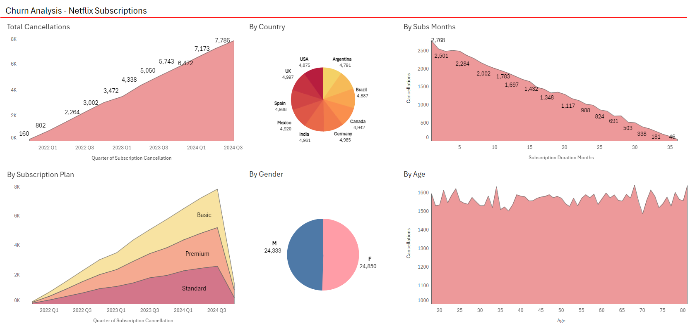

# Netflix - Análisis de Suscripciones

Analizaremos las suscripciones de la plataforma Netflix entre el 4º trimestre de 2021 y la actualidad. Un dashboard interactivo en Tableau puede ser visualizado [aquí](https://public.tableau.com/app/profile/gonzalo.extremadouro/viz/NetflixSubscriptionsAnalysis/Sales-Dashboard).

# Base del Proyecto

Netflix es una plataforma de streaming líder a nivel mundial que ofrece una amplia variedad de series, películas, documentales y contenido original. Fundada en 1997, ha evolucionado hasta ser un referente en entretenimiento digital con millones de suscriptores en todo el mundo.

La compañía tiene una cantidad significativa de datos en sus ventas (suscripciones de usuarios), oferta de productos, e información demográfica sobre sus clientes. Este proyecto analiza y sintetiza estos datos para descubrir insights que permitan mejorar el éxito comercial de Netflix.

- **Análisis de las tendencias en las ventas:** Evaluación de los patrones de suscripciones a lo largo del tiempo.
- **Rendimiento por plan:** Un desglose del rendimiento en suscripciones de los distintos planes que ofrece la plataforma.
- **Comparación regional:** Una evaluación de suscripciones por región.
- **Tasa de cancelación de clientes:** Análisis diagnóstico sobre la pérdida de clientes, buscando identificar razones y factores detrás de la cancelación de suscripciones.

Un dashboard interactivo en Tableau puede ser visualizado [aquí](https://public.tableau.com/app/profile/gonzalo.extremadouro/viz/NetflixSubscriptionsAnalysis/Sales-Dashboard).

# Estructura de los Datos & Chequeos Preliminares

La estructura del dataset de Netflix consiste en 3 tablas, con un total de 100.000 filas de suscriptores. Estas tablas con la data cruda se pueden localizar [aquí](raw_data).

Con ayuda del "Asistente para Importación y Exportación de SQL Server", importamos los tres archivos de la carpeta [raw_data](raw_data) para poder utilizar los datos en SQL.

Las consultas en SQL realizadas para la inspección y control de calidad de datos pueden ser encontradas [aquí](1_Data_Checks.sql).

Fue necesario unir las 3 tablas en SQL para poder obtener toda la información en 1 solo archivo. Estas consultas pueden ser encontradas [aquí](2_Join_Tables.sql).

Una vez conseguida la unión pertinente de las tablas, usando la herramienta mencionada al principio de esta sección, exportamos un nuevo archivo ".csv" bajo un nuevo nombre: [subs_total_data.csv](subs_total_data.csv).

Con el uso de fórmulas y lógica condicional en Excel, fueron creadas 3 nuevas columnas que pueden aportar valor al análisis:

- **subscriptions_duration_months:** indica la cantidad de meses de suscripción del usuario.
- **status:** indica si la membresía sigue activa o fue cancelada.
- **total_revenue:** calcula el aporte monetario total del usuario, multiplicando los meses de suscripción por el precio de la misma.

El archivo de Excel con dichos cálculos personalizados puede ser descargado [aquí](subs_total_data_CLEAN.xlsx).

# Métrica Estrella del Norte & Dimensiones

- **Ventas:** Total de suscripciones de los planes "básico", "estándar" y "premium".
- **Tipo de Suscripción:** básico, estándar, o premium.
- **Región:** país del usuario de la suscripción.

# Resumen de las Observaciones

### Ventas:

- Las suscripciones aumentaron un **19.4%** luego del último trimestre de 2021, superando la barrera de los **8K**. Desde entonces, la variabilidad entre los trimestres es casi **nula**.
- El año 2024 viene siendo relativamente **satisfactorio**, con un apreciable crecimiento interanual del **2.19%** observado en el primer trimestre. Ningún mes, por ahora, ha sido negativo en comparación con el año 2023.
- Aunque el último trimestre es el de mejor rendimiento con **8.492** suscripciones, se observa un estancamiento general en los últimos 2 años, con el rango de suscripciones oscilando entre los **8.000** y los **8.500**.

### Tipo de Suscripción:

- La cantidad de suscripciones por plan es **uniforme**, sin diferencias estadísticamente significativas. El plan **Premium**, al ser el más costoso, representa el 43.8% de los ingresos totales, lo que lo convierte en el mayor contribuyente a las ventas.

### Región:

- Los países más representativos en los ingresos de la empresa son **Canadá** y el **Reino Unido** con **$1.75M**. Sin embargo, la mayoría de los países muestran una distribución **homogénea** en los ingresos por ventas, con una diferencia muy escasa entre ellos.

# Análisis de Churn - Cancelación de Suscripciones

Un dashboard interactivo en Tableau con más visualizaciones de las aquí presentadas, puede ser observado [en este sitio](https://public.tableau.com/views/NetflixSubscriptionsAnalysis/Churn-Dashboard?:language=en-US&:sid=&:redirect=auth&:display_count=n&:origin=viz_share_link).

- Las bajas han ido aumentando **exponencialmente**, llegando a las **7.786** cancelaciones en el último trimestre. Esto representa un **57.2%** de crecimiento interanual, lo que es ciertamente preocupante para la salud financiera de la empresa. Un aumento tan significativo en las cancelaciones puede repercutir en los ingresos recurrentes y en los costos de adquisición de nuevos clientes, lo que pone en riesgo la sostenibilidad del negocio.
- El churn rate es del **49.18%**, una cifra muy por encima del rango de normalidad para una empresa SaaS (software como servicio), que se estima entre el **5%** y **10%**. Este nivel de churn sugiere un **problema serio** en la retención de clientes.
- Podemos observar que hay una relación lineal entre la mayor cantidad de meses de suscripción, y una probabilidad considerablemente más **baja** de cancelación. El **30.77%** de bajas se producen en los primeros **seis** meses de suscripción, lo que indicaría una insatisfacción importante con el producto.

# Recomendaciones

- Invertir en campañas de publicidad en países desarrollados que presentan los mismos ingresos que el resto, para poder cautivar nuevos clientes. Otra opción puede ser aumentar el precio de las suscripciones en estas regiones, pero esta idea podría agravar la pérdida de clientes. Se podría considerar promociones o descuentos por tiempo limitado para atraer a nuevos usuarios sin comprometer demasiado el precio.
- Recabar más información demográfica sobre los usuarios, esto puede ayudar para que el equipo de finanzas ajuste la estrategia de precios y a diseñar ofertas más atractivas o personalizadas que se alineen con las expectativas de diferentes grupos de clientes.
- El equipo de contenido podría evaluar la calidad y relevancia del contenido ofrecido para mejorar la experiencia del usuario desde el principio. Invertir en contenido exclusivo o de alta calidad que no esté disponible en otras plataformas puede ser un fuerte atractivo para retener y atraer clientes.
- Incluir encuestas de satisfacción para identificar áreas de mejora. Esto puede ayudar a la empresa a comprender mejor las razones detrás de las cancelaciones y a identificar áreas específicas de mejora.
